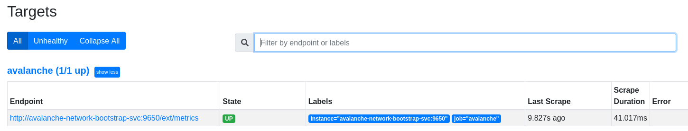

# Kubernetes Avalanche

This repository provides basic manifests to spin up a local Avalanche local network in Kubernetes with Minikube.

## Prerequisites

- A Kubernetes environment (e.g., [Minikube](https://minikube.sigs.k8s.io/docs/) 
- `git clone https://github.com/leopaul36/k8s-avalanche.git` 

## Avalanche bootstrap node

We will first a single Avalanche node from which our next nodes will bootstrap

```
kubectl create configmap avalanchego-config-bootstrap --from-file=manifests/node_bootstrap.json
kubectl apply -f manifests/network-bootstrap.yml
```

## Avalanche bootstrap service

We then need to expose the `http-port` and `staking-port` of our bootstrap node so the other nodes will be able to reach it.

```
kubectl apply -f manifests/network-bootstrap-svc.yml
```

## Avalanche cluster

The next step is to run another Avalanche node that will bootstrap from the previous one.

We need to specify the `NodeID` of the bootstrap node in a new `ConfigMap`.

The next command gives us the `NodeID` of the `node=avalanche-bootstrap` Deployment:

```
kubectl logs -l node=avalanche-bootstrap --tail=-1 | grep "node ID is" | awk '{ print $7}'
```

e.g.: `NodeID-HnjB8pmbe9QEYbCS9x7Menq9oTYTW4csD`

We also need to specify the endpoint at which our bootstrap Avalanche node can be reached. This is the IP of the previously created service:

```
kubectl get svc avalanche-network-bootstrap-svc -o custom-columns=CLUSTER-IP:.spec.clusterIP
```

e.g.: 
```
CLUSTER-IP
10.106.46.18
```

Let's replace the `bootstrap-ids` and `bootstrap-ips` property of `manifests/node_cluster.json` with the appropriate values. For example:

```
{
  "network-id": "local",
  "bootstrap-ips": "10.106.46.18:9651",
  "bootstrap-ids": "NodeID-HnjB8pmbe9QEYbCS9x7Menq9oTYTW4csD"
}
```

Now we are ready to spin up an additionnal node to our Avalanche network:

```
kubectl create configmap avalanchego-config-cluster --from-file=manifests/node_cluster.json
kubectl apply -f manifests/network-statefulset.yml
```

The bootstrapping went fine. Let's add some more replicas to have a bigger Avalanche network.

```
kubectl scale statefulset avalanche-network-statefulset --replicas=5
```

## Monitoring

The Avalanche Cluster is ready. Before starting to deploy contracts or subnets, we will deploy some monitoring services to see how our cluster behaves.

### Prometheus

A cool thing about [AvalancheGo](https://github.com/ava-labs/avalanchego) is that it embeds a [Prometheus](https://prometheus.io/) compatible metrics api out-of-the-box.

If we deploy and properly configure a Prometheus instance in the Kubernetes cluster, we will be able to scrap theses metrics for montoring.

```
kubectl create configmap prometheus-config --from-file=manifests/monitoring/prometheus.yml
kubectl apply -f manifests/monitoring/prometheus-dep.yml
kubectl apply -f manifests/monitoring/prometheus-svc.yml
```

Let's open the Prometheus UI (`minikube service prometheus-svc`) and see if the `avalanche` target is running:



It works, Prometheus is scrapping the data from the Avalanche bootstrap node. 

### Grafana

The final step to have a complete monitoring is setting up [Grafana](https://grafana.com/) to visualize the Avalanche nodes metrics gathered in Prometheus.

```
kubectl apply -f manifests/monitoring/provisionning/grafana-dashboards-cm.yml
kubectl apply -f manifests/monitoring/provisionning/grafana-dashboards-provisionning-cm.yml
kubectl apply -f manifests/monitoring/provisionning/grafana-datasource-provisionning-cm.yml
kubectl apply -f manifests/monitoring/grafana-dep.yml
kubectl apply -f manifests/monitoring/grafana-svc.yml
```

We can then open Grafana (`minikube service grafana-svc`) and check out our metrics. Here is an excerpt of the pre-configured `Network` dashboard:


Nothing much to see here because we have not deployed anything on the network yet but we can notice the surge of `peer count` and global activity when we scaled the cluster to 5 replicas.

## TODO

- [ ] Improve README.md
- [ ] Improve [Monitoring](https://docs.avax.network/build/tutorials/nodes-and-staking/setting-up-node-monitoring/) by adding node_exporter metrics and enabling [Kubernetes service discovery](https://prometheus.io/docs/prometheus/latest/configuration/configuration/#kubernetes_sd_config)

## Related projects and sources

- https://github.com/ava-labs/avalanche-network-runner
- https://github.com/ava-labs/avalanchego
- https://docs.avax.network/build/tutorials/nodes-and-staking/setting-up-node-monitoring/
